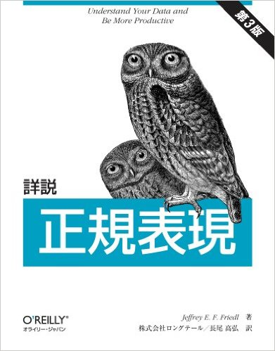
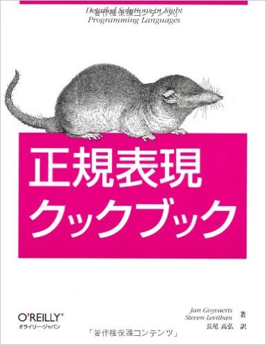

RとMeCabと正規表現
========================================================
author: @y__mattu
date: 2016/7/30
autosize: true

Tokyo.R #55　LT

<style>
body {
    overflow: scroll;
}
</style>

<style>
.bottom_right img {
    position: relative;
    left: 700px;
    top: 10px;
}</style>
<div class="bottom_right" markdown="1">

</div>


自己紹介
========================================================

- 松村優哉
- 大学生
- 計量経済学、統計学、マーケティング
- 言語: SAS, R, Python
- R歴: 1年半くらい
- ブログ: http://y-mattu.hatenablog.com


RMeCabパッケージ
========================================================
Rで形態素解析ができます。

```r
library(RMeCab)
res <- RMeCabC("すもももももももものうち")
```

結果はこんな感じ
========================================================

```r
res
```

```
[[1]]
    名詞 
"すもも" 

[[2]]
助詞 
"も" 

[[3]]
  名詞 
"もも" 

[[4]]
助詞 
"も" 

[[5]]
  名詞 
"もも" 

[[6]]
助詞 
"の" 

[[7]]
  名詞 
"うち" 
```

しかし顔文字や特殊解文字の解析は
========================================================

```r
RMeCabC("☆*:.｡. o(≧▽≦)o .｡.:*☆")
```

```
[[1]]
     名詞 
"☆*:.｡." 

[[2]]
名詞 
 "o" 

[[3]]
      名詞 
"(≧▽≦)" 

[[4]]
名詞 
 "o" 

[[5]]
     名詞 
".｡.:*☆" 
```

========================================================

```r
RMeCabC("Tokyo.RでLTするよ♪")
```

```
[[1]]
   名詞 
"Tokyo" 

[[2]]
名詞 
 "." 

[[3]]
名詞 
 "R" 

[[4]]
助詞 
"で" 

[[5]]
名詞 
"LT" 

[[6]]
  動詞 
"する" 

[[7]]
助詞 
"よ" 

[[8]]
名詞 
"♪" 
```

こんなデータを分析したいとき辛い
========================================================

```r
library(knitr)
library(dplyr)
#datというオブジェクト名で以下を作成
```

|words                                 |
|:-------------------------------------|
|ふう。お腹いっぱい( ´•౪•`)           |
|暇だな(☝ ՞ਊ ՞)☝                       |
|試験頑張るぞ＼＼\ ٩( ‘ω’ )و //／／ |

冗談ではなく、口コミデータやSNSデータにはこの手の物は多い

実際
========================================================

```r
res1 <- docDF(target = dat, column = 1, type = 1, nDF = 1)
```

```
number of extracted terms = 27
now making a data frame. wait a while!
```


|N1       |POS1   |POS2           | Row1| Row2| Row3|
|:--------|:------|:--------------|----:|----:|----:|
|(        |名詞   |サ変接続       |    1|    0|    1|
|(☝       |名詞   |サ変接続       |    0|    1|    0|
|)        |名詞   |サ変接続       |    0|    0|    1|
|)☝       |名詞   |サ変接続       |    0|    1|    0|
|//／／   |名詞   |サ変接続       |    0|    0|    1|
|´•      |名詞   |サ変接続       |    1|    0|    0|
|ω       |記号   |アルファベット |    0|    0|    1|
|՞        |記号   |一般           |    0|    1|    0|
|՞ਊ       |記号   |一般           |    0|    1|    0|
|و        |記号   |一般           |    0|    0|    1|
|٩        |記号   |一般           |    0|    0|    1|
|౪        |記号   |一般           |    1|    0|    0|
|‘       |記号   |括弧開         |    0|    0|    1|
|’       |記号   |括弧閉         |    0|    0|    1|
|•`)      |名詞   |サ変接続       |    1|    0|    0|
|。       |記号   |句点           |    1|    0|    0|
|いっぱい |名詞   |接尾           |    1|    0|    0|
|お腹     |名詞   |一般           |    1|    0|    0|
|ぞ       |助詞   |終助詞         |    0|    0|    1|
|だ       |助動詞 |*              |    0|    1|    0|
|な       |助詞   |終助詞         |    0|    1|    0|
|ふう     |動詞   |自立           |    1|    0|    0|
|暇       |名詞   |一般           |    0|    1|    0|
|試験     |名詞   |サ変接続       |    0|    0|    1|
|頑張る   |動詞   |自立           |    0|    0|    1|
|＼       |記号   |一般           |    0|    0|    1|
|＼\      |名詞   |サ変接続       |    0|    0|    1|

名詞と形容詞に絞っても
========================================================

|N1       |POS1 |POS2     | Row1| Row2| Row3|
|:--------|:----|:--------|----:|----:|----:|
|(        |名詞 |サ変接続 |    1|    0|    1|
|(☝       |名詞 |サ変接続 |    0|    1|    0|
|)        |名詞 |サ変接続 |    0|    0|    1|
|)☝       |名詞 |サ変接続 |    0|    1|    0|
|//／／   |名詞 |サ変接続 |    0|    0|    1|
|´•      |名詞 |サ変接続 |    1|    0|    0|
|•`)      |名詞 |サ変接続 |    1|    0|    0|
|いっぱい |名詞 |接尾     |    1|    0|    0|
|お腹     |名詞 |一般     |    1|    0|    0|
|暇       |名詞 |一般     |    0|    1|    0|
|試験     |名詞 |サ変接続 |    0|    0|    1|
|＼\      |名詞 |サ変接続 |    0|    0|    1|
- ゴミが多くて分析にならない
- `docDF` 関数は `pos = c("名詞", "形容詞") ` オプションで出力する品詞の指定ができます

そこで正規表現
========================================================
## 正規表現ってなんだっけ
「パターンを指定して、文字列を効率よく検索・置換するための呪文みたいなやつ」

郵便番号を探す
```
/^\d{3}\-\d{4}$/
```

携帯の電話番号を探す
```
/^0\d0-\d{4}-\d{4}$/
```

Rにおける正規表現
========================================================

```r
text <- c("あいうえお", "abcde", "12345")

#小文字アルファベットを含むものを抽出
grep(pattern = "[a-z]", x = text, value = TRUE)
```

```
[1] "abcde"
```

```r
#数字を「あいう」に置換
sub(pattern = "[1-9]", x = text, replacement = "あいう")
```

```
[1] "あいうえお" "abcde"      "あいう2345"
```

```r
gsub(pattern = "[1-9]", x = text, replacement = "あいう")
```

```
[1] "あいうえお"                     "abcde"                         
[3] "あいうあいうあいうあいうあいう"
```


せっかくなので{stringr}
========================================================

```r
library(stringr)

#小文字アルファベットとマッチするかをlogicalに返す
str_detect(string = text, pattern = "[a-z]")
```

```
[1] FALSE  TRUE FALSE
```

```r
##数字を「あいう」に置換
str_replace(string = text, pattern = "[1-9]", replacement = "あいう")
```

```
[1] "あいうえお" "abcde"      "あいう2345"
```

```r
str_replace_all(string = text, pattern = "[1-9]", replacement = "あいう")
```

```
[1] "あいうえお"                     "abcde"                         
[3] "あいうあいうあいうあいうあいう"
```

正規表現で前処理
========================================================
「日本語だけを抽出」が正規表現だと意外と難しい

```r
#パンクチュエーション文字を削除した列で上書き
dat %>%
  mutate(words = str_replace_all(.$words, "[:punct:]", "")) %>%
  kable
```


|words                 |
|:---------------------|
|ふうお腹いっぱい ´౪` |
|暇だな☝ ਊ ☝           |
|試験頑張るぞ ٩ ω و   |
- この正規表現では消しきれない
- 複雑な正規表現を書いてもいいがもっと簡単にやりたい
→後処理


正規表現で後処理
========================================================
{RMeCab}で解析してから余分な行を消す

```r
#「パンクチュエーション文字がない行」を残す
res1 %>% 
  filter(POS1 == "名詞", 
         str_detect(.$N1, "[:punct:]") == FALSE
        ) %>%
  kable
```


|N1       |POS1 |POS2     | Row1| Row2| Row3|
|:--------|:----|:--------|----:|----:|----:|
|いっぱい |名詞 |接尾     |    1|    0|    0|
|お腹     |名詞 |一般     |    1|    0|    0|
|暇       |名詞 |一般     |    0|    1|    0|
|試験     |名詞 |サ変接続 |    0|    0|    1|


この辺は関数化すると楽？
========================================================

```r
#docDF用の後処理関数を作成
trush_delete <- function (x) {
  x <- filter(x, (POS1 == "名詞" | POS1 == "形容詞"), 
                 str_detect(x$N1, "[:punct:]") == FALSE, 
                 str_detect(x$N1, "[A-z0-9]") == FALSE,
                 str_detect(x$N1, "[Α-ω]") == FALSE,
                 str_detect(x$N1, "[А-я]") == FALSE,
                 str_detect(x$N1, "[ｦ-ﾝ]") == FALSE
              )
}
```

========================================================

```r
#docDF関数に適用
res2 <- docDF(target = dat, column = 1, type = 1, nDF = 1) %>%
  trush_delete()
```

```
number of extracted terms = 27
now making a data frame. wait a while!
```


|N1       |POS1 |POS2     | Row1| Row2| Row3|
|:--------|:----|:--------|----:|----:|----:|
|いっぱい |名詞 |接尾     |    1|    0|    0|
|お腹     |名詞 |一般     |    1|    0|    0|
|暇       |名詞 |一般     |    0|    1|    0|
|試験     |名詞 |サ変接続 |    0|    0|    1|
- データに合わせて正規表現の部分は調整
- {RMeCab}の他の関数だと列名が違ったりするので注意

検証環境
========================================================
## 環境
- Mac OS X El Capitan
- R 3.3.1
- Rstudio 0.99.903

## パッケージ
- RMeCab 0.99993
- dplyr 0.5.0
- stringr 1.0.0
- knitr 1.13


参考文献
========================================================
## RMeCabについて
- [ RとPythonでMeCabを使う環境構築(Windows, Mac)](http://y-mattu.hatenablog.com/entry/2016/01/06/030929)
- [RMeCab](http://rmecab.jp/wiki/index.php?RMeCab)
- [RMeCabの機能](http://rmecab.jp/wiki/index.php?RMeCabFunctions#icae4377)
- [RMeCabの顔文字の誤解析を後処理で消す](http://y-mattu.hatenablog.com/entry/2016/02/24/223456)

## 正規表現について
- [初心者歓迎！手と目で覚える正規表現入門](http://qiita.com/jnchito/items/893c887fbf19e17d3ff9)
- [R における正規表現](http://www.okadajp.org/RWiki/?R%20%E3%81%AB%E3%81%8A%E3%81%91%E3%82%8B%E6%AD%A3%E8%A6%8F%E8%A1%A8%E7%8F%BE)
- [忘れっぽい人のための正規表現チートシート](http://qiita.com/tossh/items/635aea9a529b9deb3038)
- [正規表現 | Rで正規表現マッチングや後方参照する方法](http://stat.biopapyrus.net/r/regex.html)
- [rexパッケージを使ってRでの正規表現を身につける](http://qiita.com/uri/items/1aedc5030acc5d3691c2)

========================================================
## 書籍


Enjoy!!
========================================================
- twitter: [@y__mattu](https://twitter.com/y__mattu)
- blog: http://y-mattu.hatenablog.com

<div class="bottom_right" markdown="1">

</div>
